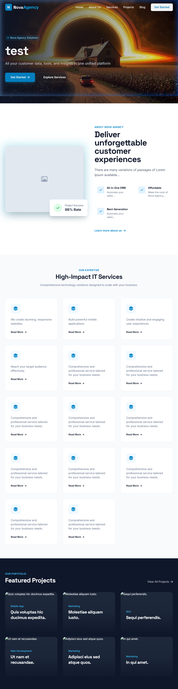
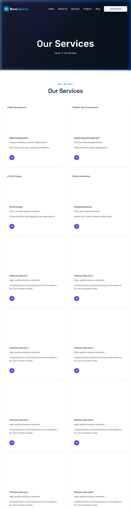
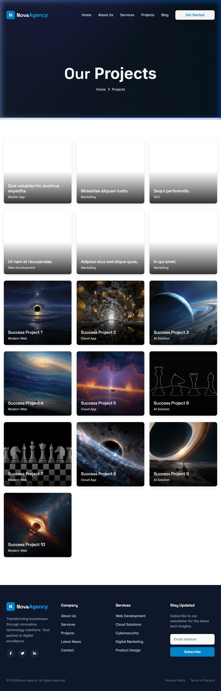
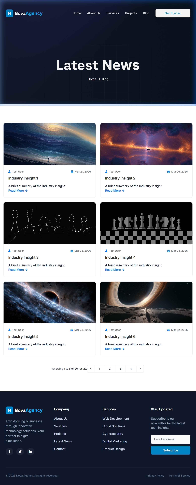
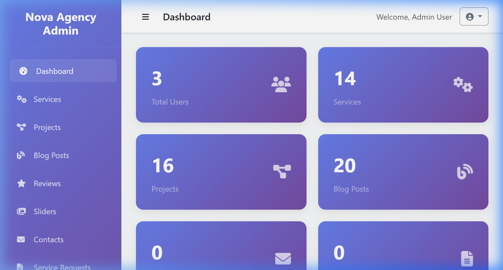
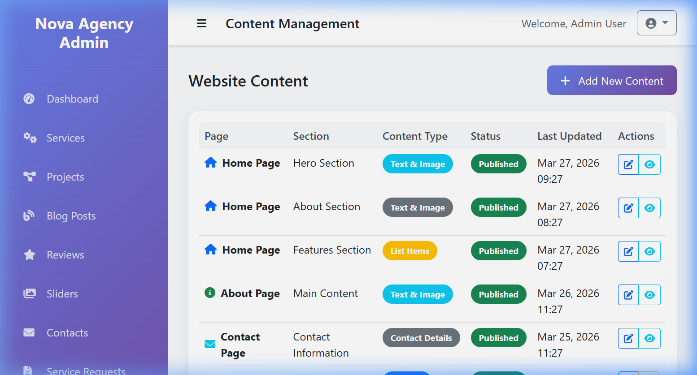

# Nova Agency CMS


A powerful, modern, and fully responsive Content Management System (CMS) tailored for Digital Agencies and IT Service providers. Built on **Laravel 12**, it features a beautiful **Tailwind CSS** frontend and a comprehensive Admin Panel for dynamic content control.

## 📸 Project Screenshots

### Public Website
| Homepage | Services |
| :---: | :---: |
|  |  |

| Projects | Blog |
| :---: | :---: |
|  |  |

### Admin Backoffice
| Dashboard | Content Management |
| :---: | :---: |
|  |  |

---

## 👥 User Roles & Use Cases

### 1. **Administrator**
- **Role**: Full system control.
- **Access**: Complete access to the Admin Panel (`/admin`).
- **Use Cases**:
  - Manage all website content (Services, Projects, Blogs, Sliders).
  - Manage application users and roles.
  - Configure global site settings.
  - Review and manage Contact and TC (Technical) requests.

### 2. **Content Editor**
- **Role**: Content management focus.
- **Access**: Limited access to the Admin Panel.
- **Use Cases**:
  - Create and edit Blog posts and Portfolio projects.
  - Update Service descriptions and Testimonials.
  - Manage Sliders for marketing campaigns.

### 3. **Public Visitor / Client**
- **Role**: End-user.
- **Access**: Public frontend (`/`).
- **Use Cases**:
  - Browse agency services and "About Us" information.
  - Explore past projects and case studies.
  - Read industry insights on the Blog.
  - Submit inquiries via the Contact form or request a quote via the TC Request form.

---

## 🛠️ Key Features

- **Modern Frontend**: Built with Tailwind CSS and Alpine.js for a premium, responsive UI.
- **Dynamic Content**: Every section of the site (Hero, Services, Projects, Reviews, etc.) is manageable from the backoffice.
- **Role-Based Access**: Secure admin panel with distinct access levels for Admins and Editors.
- **Lead Generation**: Integrated contact and request forms with status tracking in the admin panel.
- **SEO Ready**: Dynamic meta tags and clean HTML structure.

---

## 🚀 Installation & Local Setup

### System Requirements
- PHP 8.2+
- Node.js & NPM
- SQLite (or MySQL)

### Steps

1. **Clone the repository**
   ```bash
   git clone [repository-url]
   cd Enterprise-Service-Hub-Laravel
   ```

2. **Install Dependencies**
   ```bash
   composer install
   npm install
   ```

3. **Environment Setup**
   ```bash
   cp .env.example .env
   php artisan key:generate
   ```
   *Note: Ensure `DB_CONNECTION=sqlite` is set in `.env` for quick local testing.*

4. **Database Setup**
   ```bash
   touch database/database.sqlite
   php artisan migrate --seed
   ```

5. **Storage Link**
   ```bash
   php artisan storage:link
   ```

6. **Run Locally**
   ```bash
   npm run dev
   php artisan serve
   ```

---

## 📄 License

The framework is open-sourced software licensed under the [MIT license](https://opensource.org/licenses/MIT).
