# Nova Agency CMS


A powerful, modern, and fully responsive Content Management System (CMS) tailored for Digital Agencies and IT Service providers. Built on **Laravel 12**, it features a beautiful **Tailwind CSS** frontend and a comprehensive Admin Panel for dynamic content control.

## 📸 Public Website Preview

| Home | About Us | Contact |
| :---: | :---: | :---: |
| 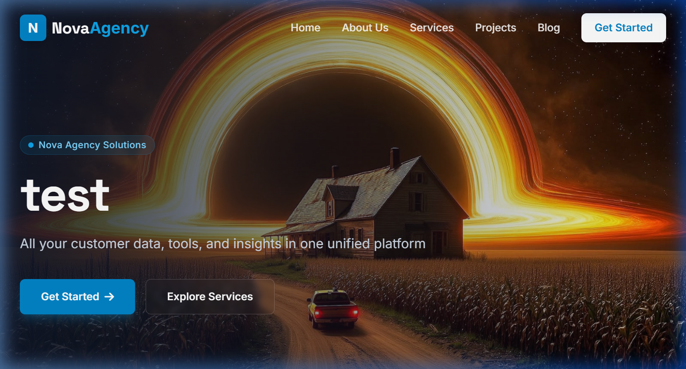 | 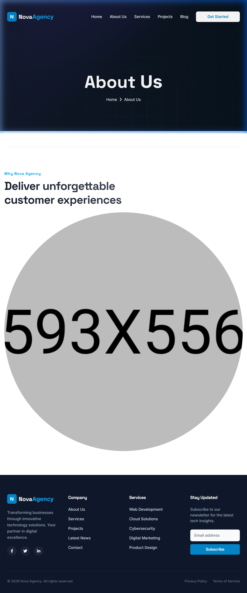 | 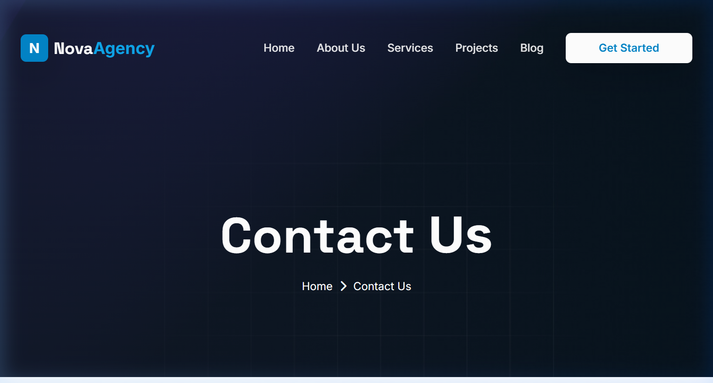 |

| Services | Projects | Blog |
| :---: | :---: | :---: |
| 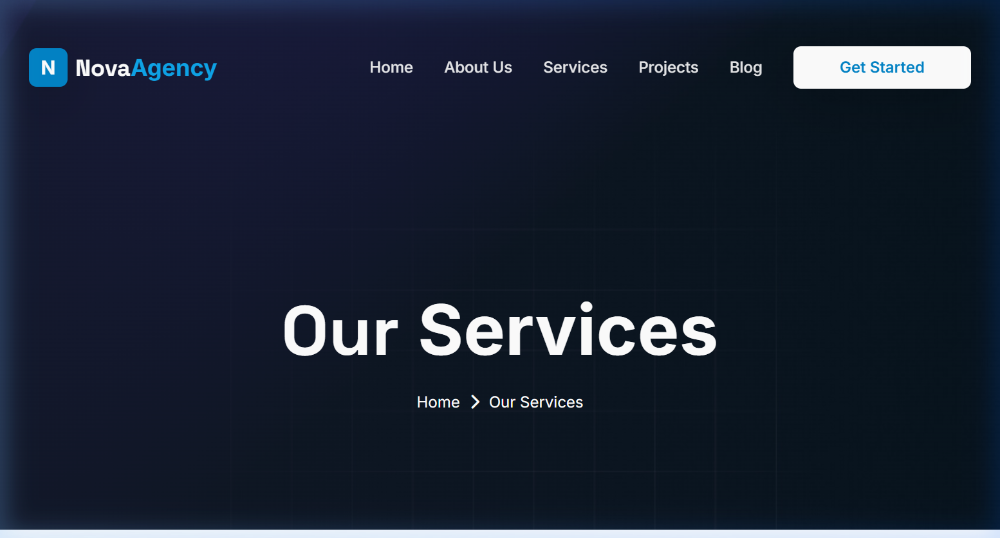 | 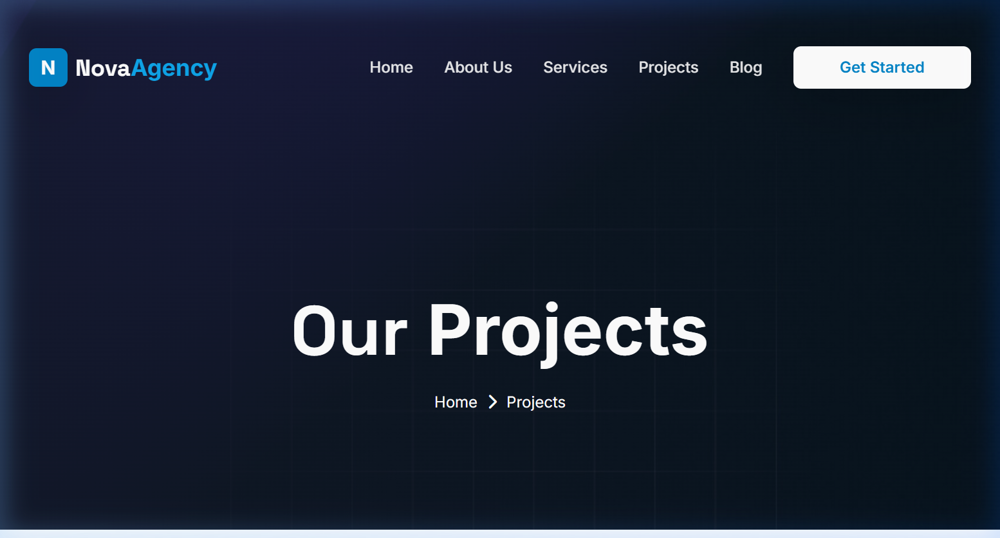 | 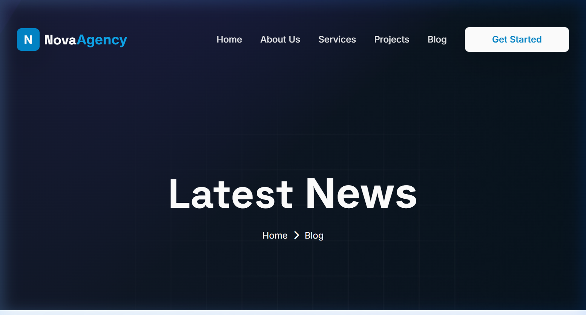 |

## 🛠️ Admin Backoffice (Full Control)

The backoffice provides modular control over every aspect of the agency's online presence.

### Dashboard & Analytics
| Dashboard | Content & Settings |
| :---: | :---: |
|  | 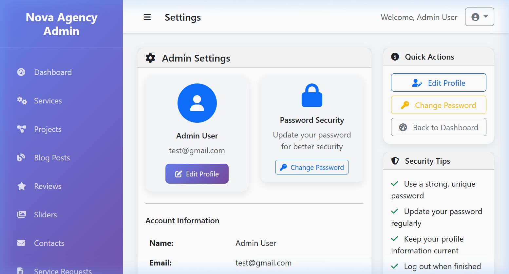 |

### Module Management
| Services | Projects | Blogs |
| :---: | :---: | :---: |
| 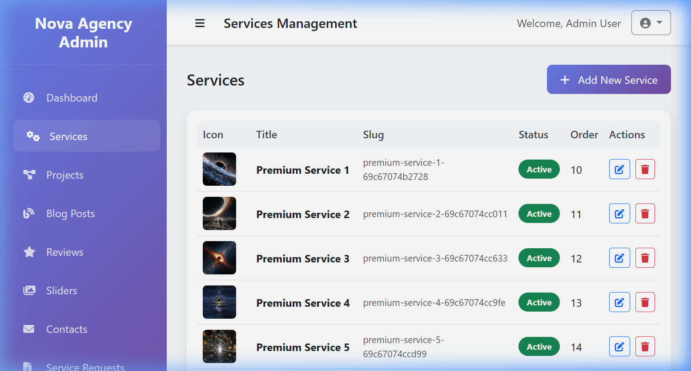 | 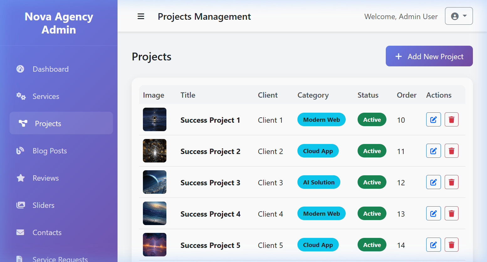 | 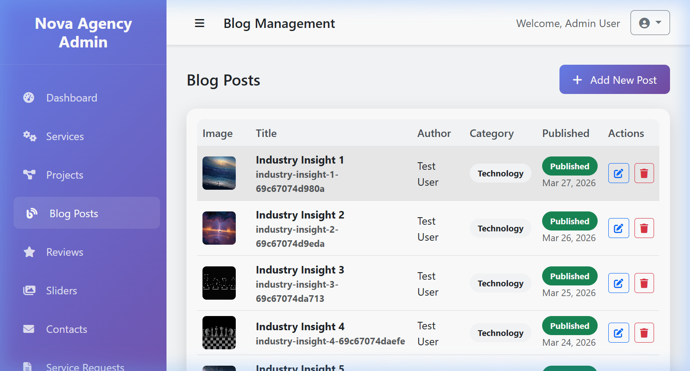 |

| Sliders | Reviews | Users |
| :---: | :---: | :---: |
| 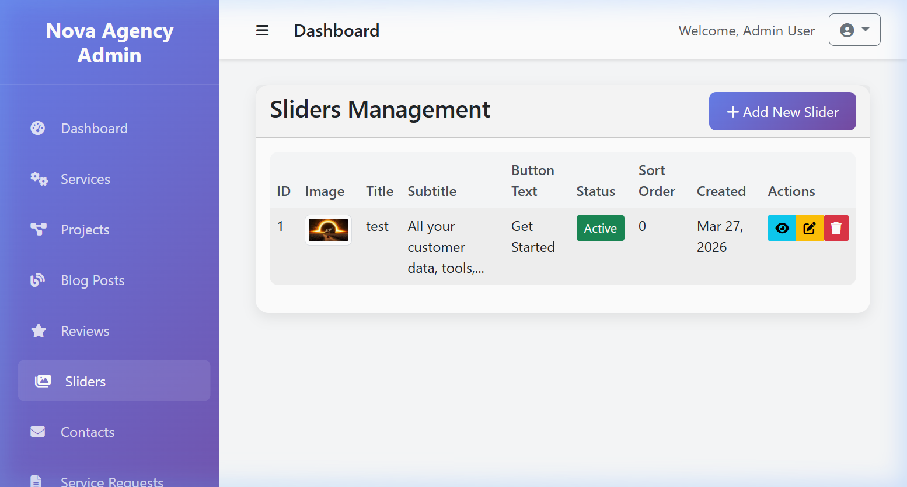 | 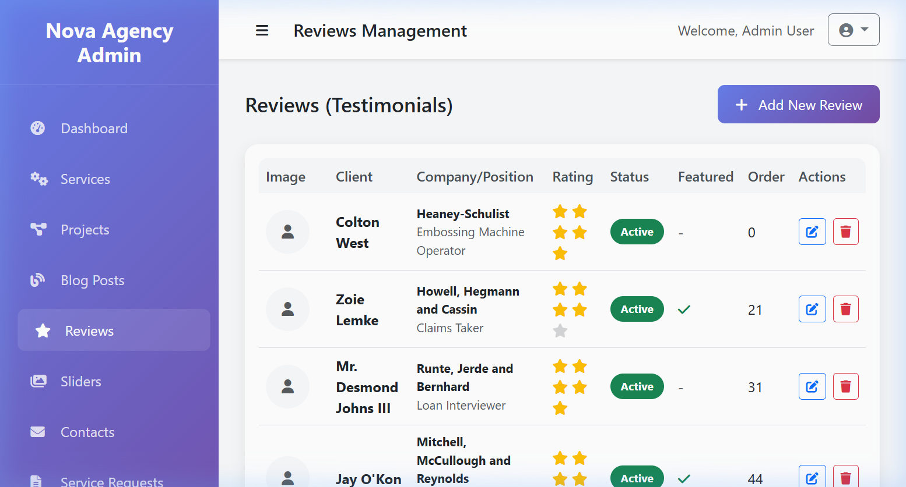 | 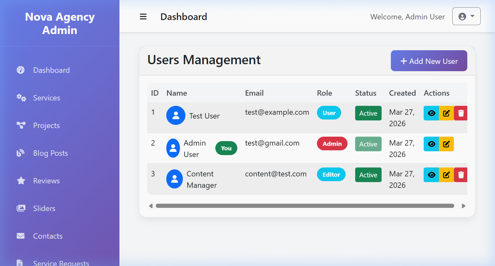 |

### Lead Management
| Contact Messages | Service Requests |
| :---: | :---: |
| 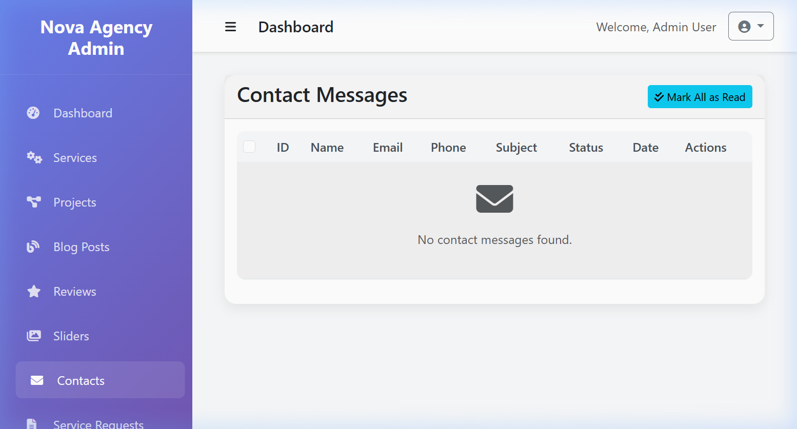 | 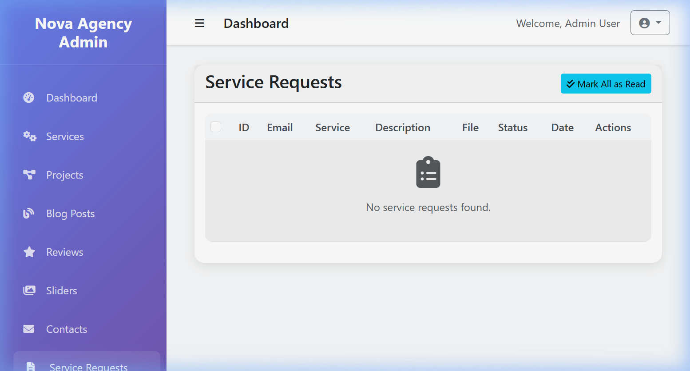 |

---

## 👥 User Roles & Use Cases

### 1. **Administrator**
- **Role**: Full system architect and controller.
- **Access**: Complete access to all `/admin` modules.
- **Use Cases**:
  - Manage all website content (Services, Projects, Blogs, Sliders).
  - Manage application users, roles, and system security.
  - Configure global site settings and metadata.
  - Review and analyze Contact and Technical (TC) requests.

### 2. **Content Editor**
- **Role**: Marketing and content focus.
- **Access**: Access to dynamic content modules (Services, Blogs, Projects).
- **Use Cases**:
  - Keep the agency blog updated with industry trends.
  - Add new successful projects to the portfolio.
  - Manage client testimonials and homepage sliders.

### 3. **Public Visitor / Client**
- **Role**: End-user.
- **Access**: Public frontend (`/`).
- **Use Cases**:
  - Research agency services and expertise.
  - View "Case Studies" (Projects) with high-quality visual results.
  - Submit service inquiries and request detailed technical quotes.

---

## 🛠️ Key Features

- **Modern Frontend**: Premium UI/UX using Tailwind CSS 3.4 and glassmorphism.
- **Modular Backoffice**: Custom-built CRUD systems for every entity.
- **Lead Tracking**: Built-in lead management for contacts and technical inquiries.
- **Seeded Data**: Ready-to-use custom test data with localized imagery for immediate testing.
- **SEO Ready**: Optimized for search engines with semantic HTML and dynamic tags.

---

## 🚀 Installation & Local Setup

### System Requirements
- PHP 8.3+
- Node.js & NPM
- SQLite (recommended for local preview) or MySQL

### Steps

1. **Clone the repository**
   ```bash
   git clone [repository-url]
   cd Enterprise-Service-Hub-Laravel
   ```

2. **Install Dependencies**
   ```bash
   composer install
   npm install
   ```

3. **Environment Setup**
   ```bash
   cp .env.example .env
   php artisan key:generate
   ```
   *Note: Set `DB_CONNECTION=sqlite` in `.env` for quick local testing.*

4. **Database Setup**
   ```bash
   touch database/database.sqlite
   php artisan migrate --seed
   ```

5. **Create Admin User**
   If you didn't use the seeders, or want to create a new admin, run:
   ```bash
   php artisan make:admin
   ```
   Follow the interactive prompts to create your first Administrator account.

6. **Storage Link**
   ```bash
   php artisan storage:link
   ```

6. **Run Locally**
   ```bash
   npm run dev
   php artisan serve
   ```

---

## 📄 License

The framework is open-sourced software licensed under the [MIT license](https://opensource.org/licenses/MIT).
